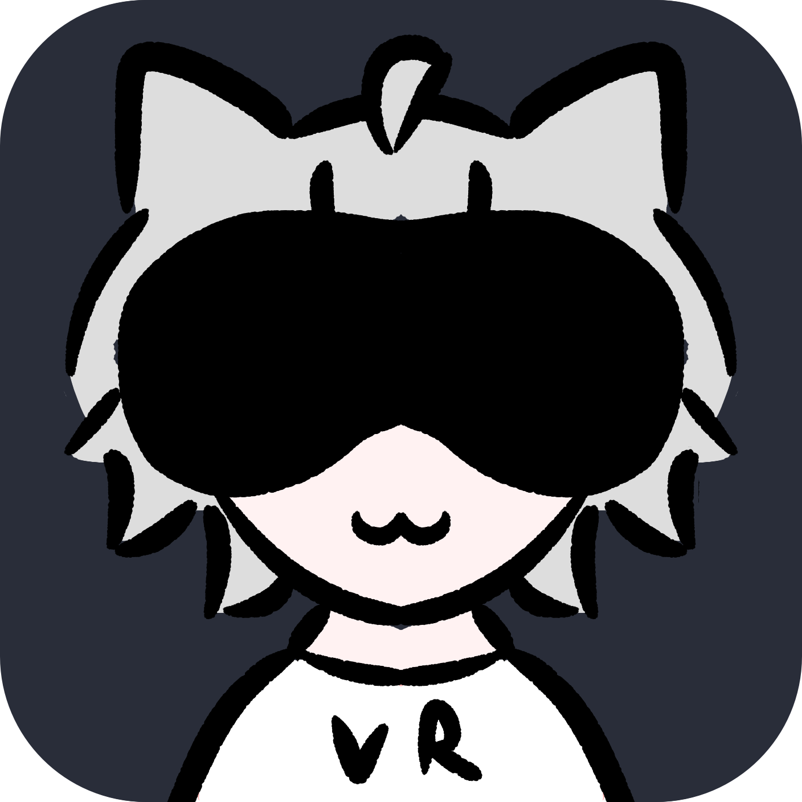

# VR to VTube Studio

Use your VR headset as a face tracker for VTube Studio while you play. Eyes, mouth, brows, and neck move on your model.

<p align="center">

</p>

**[Download for Windows](https://github.com/fukustarVT/VR-to-VTube-Studio/releases/latest/download/VR.to.VTube.Studio.exe)**

The download is one `.exe`. [All releases](https://github.com/fukustarVT/VR-to-VTube-Studio/releases) are on GitHub.

Start [SteamVR](https://store.steampowered.com/app/250820/SteamVR/) so the headset can move the neck. [VRCFaceTracking](https://vrcft.io/) reads the face from whatever headset module you already use. This app is the receiver it is looking for, then it sends that face to [VTube Studio](https://denchisoft.com/).

## What you need

- Windows
- A headset with a VRCFaceTracking module
- [SteamVR](https://store.steampowered.com/app/250820/SteamVR/)
- [VRCFaceTracking](https://vrcft.io/)
- [VTube Studio](https://denchisoft.com/) on the PC

## Using the app

1. Put the headset on and start **SteamVR**.
2. Open **VR to VTube Studio** and press **Start**. Look straight ahead. That pose is the neck center.
3. Open VRCFaceTracking. If it was already open, fully quit it and open it again. It only looks for the app when it starts. Turn **Force Relevancy** off, and make sure the module for your headset says it is tracking.
4. In VTube Studio, open Settings and turn **Start API** on. Leave the port at `8001`.
5. The first time, VTube Studio asks you to allow **VRCFT Bridge**. Click Allow.

The window also links to SteamVR, VRCFaceTracking, and VTube Studio if you do not have them yet.

Three dots on the window tell you what is connected:

| Dot | Ready when it says |
| --- | --- |
| Neck | Connected |
| Face tracking | Connected |
| VTube Studio | Connected |

Press **Reset neck** any time you want a new center. Look straight ahead when you press it.

## Sliders

Move these while the app is running. The starting positions are the defaults.

| Slider | What it changes |
| --- | --- |
| Neck amount | How far your head turns, nods, and tilts |
| Eye size | How open the eyes are when your face is relaxed |
| Eye movement | How far the eyes look |
| Mouth open | How wide the mouth opens |
| Smile | The resting mouth, from a frown to a smile |
| Brows | How much the eyebrows move |

**Flip turn**, **Flip nod**, and **Flip tilt** reverse a neck axis if the model moves the wrong way.

## If something does not move

- **Neck stays on Waiting for SteamVR.** SteamVR is not running, or the headset is not tracking yet. The neck does not wait for VTube Studio.
- **Face tracking stays on Waiting for VRCFaceTracking.** Quit VRCFaceTracking completely and open it again after you press Start. Your headset module inside VRCFaceTracking has to be active.
- **The model does not match what you see in the mirror.** Brows, cheeks, and tongue only move if that model has those inputs hooked up in VTube Studio.
- **A model mouth stays shut.** Check the model settings. A parameter set to a fixed value ignores tracking.
- **Eyes or mouth look extreme at rest.** Bring **Eye size** and **Smile** back toward the middle.

## For developers

The window is `vrcft_vtube_app.py`. The bridge is `vrcft_to_vts.py`. Running the bridge directly still works:

```bash
pip install python-osc websockets zeroconf openvr
python vrcft_vtube_app.py
```

To build the single file people can double-click, on Windows:

```bat
build.bat
```

That writes `dist\VR to VTube Studio.exe`. The build has to happen on Windows because the neck uses SteamVR. Keep `icon.ico` in the same folder.

`vts_token.json` is created next to the program the first time VTube Studio allows the plugin. It is the saved permission. Do not commit it.
